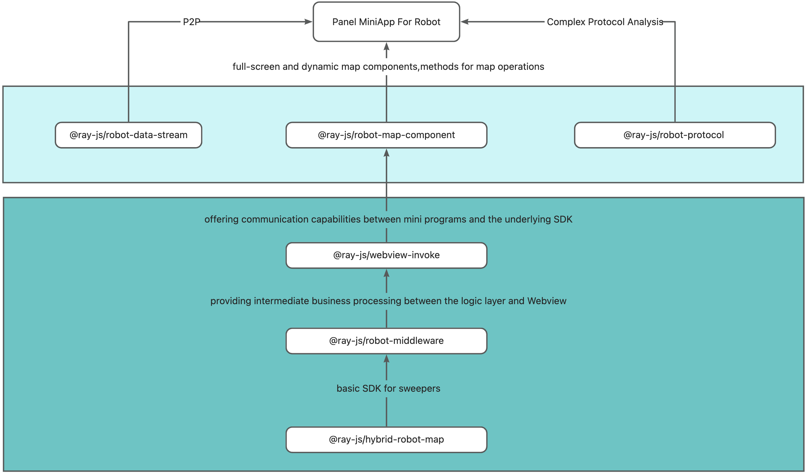

[English](README.md) | 简体中文

## Laser Sweeper Template

## 1. Usage Instructions

- Before developing with this template, you need to have a basic understanding of the Ray framework. It is recommended to first refer to the [Ray Development Documentation](https://developer.tuya.com/cn/miniapp/develop/ray/guide/overview).
- Understand the [SDM Development Method](https://developer.tuya.com/cn/miniapp/develop/ray/extended/common/sdm/usage).

## 2. Getting Started Quickly

- [Create a Product](https://developer.tuya.com/cn/miniapp/develop/miniapp/guide/start/quick-start#%E4%BA%8C%E5%88%9B%E5%BB%BA%E4%BA%A7%E5%93%81)
- [Create a Mini Program](https://developer.tuya.com/cn/miniapp/common/desc/platform)

## 3. Development Considerations

- The IDE currently does not support P2P channels. When developing on the IDE, please install the [Robot Vacuum Debugger](https://developer.tuya.com/cn/miniapp/devtools/tools/extension/panel). This plugin supports real connections to actual sweeper devices and can simulate data reporting.
- When developing on the IDE, the IndoorMap.Dynamic component cannot be debugged using the Robot Vacuum Debugger and requires debugging on a real device.
- If you are a new customer, please contact Tuya's project manager to obtain the sweeper's protocol documentation.

## 4. Capability Dependencies

- App Version
  - Tuya Smart 5.15.0 and above
- TTT Dependencies
  - BaseKit: 3.0.0
  - MiniKit: 3.0.1
  - DeviceKit: 4.0.8
  - BizKit: 4.2.0
  - P2PKit: 2.1.1
  - IPCKit: 5.16.2
- Component Dependencies

  - [Smart UI](https://developer.tuya.com/material/smartui?comId=help-getting-started)

- IDE Plugin Dependencies
  - [Robot Vacuum Debugger](https://developer.tuya.com/cn/miniapp/devtools/tools/extension/panel)

## 5. Module Dependencies

To allow developers to focus more on UI processing without worrying too much about other process logic, we have modularized the sweeper, separating the underlying implementation from business calls. Currently, the main packages the sweeper panel relies on are as follow:

- @ray-js/robot-map-component for direct business layer calls, providing full-screen and dynamic map components [Reference Usage](src/components/MapView/index.tsx), and exposing common methods for map operations.
- @ray-js/robot-data-stream for direct business layer calls, encapsulating the panel-to-device P2P transmission methods, allowing developers to ignore the complex processes of P2P communication and focus only on the business logic itself.
- @ray-js/robot-protocol for direct business layer calls, providing full protocol parsing capabilities, encapsulating the parsing and encoding process of complex raw type dp points in the sweeper protocol.
- @ray-js/webview-invoke as an underlying dependency, offering communication capabilities between mini programs and the underlying SDK, generally not requiring modifications.
- @ray-js/robot-middleware as an underlying dependency, providing intermediate business processing between the logic layer and Webview.
- @ray-js/hybrid-robot-map as an underlying dependency, a basic SDK for sweepers providing rendering capabilities for underlying layers.

For general sweeper needs, you mainly focus on application business logic and UI display, without having to worry about the implementation of internal dependency packages. Dependency package upgrades will be backward compatible, allowing for separate upgrades in the project.

## 6. Selection of Map Components

In terms of selecting map components, we offer two modes: IndoorMap.Full and IndoorMap.Dynamic.

The IndoorMap.Full component is introduced as a native WebView in a separate layer structure, which can only be set to full screen and cannot be dynamically resized. It operates on a dual-thread architecture, independent of the logic and view layers of the mini program, providing better interactive performance. If you need to overlay view buttons on the WebView, please use it in conjunction with CoverView. For more details, please refer to the examples in the template.

The IndoorMap.Dynamic component is an RJS component that serves as an extension of the view layer component, allowing for dynamic setting of the component's width and height. The IndoorMap.Dynamic component runs within the view layer of the mini program and shares the same hierarchical structure as the page elements. During frequent map data interactions, this may affect the interactive response of the view elements.

## 7. Panel Features

- Multi-mode Cleaning
- Map Management
- No-go/Virtual Wall Editing
- Room Editing
- Device Timing
- Do Not Disturb Mode
- Cleaning Records
- Voice Package Settings

## 8. Future Plans

- Template supports room attribute settings
- Template supports camera-related features
- Template supports AI object recognition features
- Documentation for using sweeper components

## 9. Feedback

If you have questions, please visit the link and submit a post for feedback: https://tuyaos.com/viewforum.php?f=10

## 10. License

[License Details](LICENSE)
